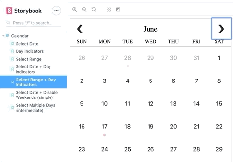

# react-calendar-components

A project exploring composing UI and behavior in [React](facebook.github.io/react/) for a customizable calendar component using [higher order components](https://reactjs.org/docs/higher-order-components.html).


Live demo: [https://erikthedeveloper.github.io/react-calendar-components/](https://erikthedeveloper.github.io/react-calendar-components/?path=/story/calendar--select-range-day-indicators)

## Summary

To summarize the overall approach used:

1. Enhance `Calendar` with desired features via applying related higher order components. These can be applied either [singly (example)](https://github.com/erikthedeveloper/react-calendar-components/blob/master/src/stories/Calendar-stories.js#L16-L18) or [by combining multiple (example)](https://github.com/erikthedeveloper/react-calendar-components/blob/master/src/stories/Calendar-stories.js#L47-L50)
2. Each [`Calendar` higher order component](https://github.com/erikthedeveloper/react-calendar-components/blob/master/src/components/Calendar) is intended to be composable. This is primarily enabled through treating `Day` as a [Component as prop](https://github.com/erikthedeveloper/react-calendar-components/blob/master/src/components/Calendar/Calendar.js#L74)...
3. ...and having each `Calendar` HoC "enhance" its own `props.DayComponent` _(also via composing higher order components)_ [see this usage](https://github.com/erikthedeveloper/react-calendar-components/blob/master/src/components/Calendar/indicators.js#L18-L37)
4. The [`EnhanceDay` render callback component](https://github.com/erikthedeveloper/react-calendar-components/blob/master/src/components/Calendar/EnhanceDay.js) ensures that each Calendar's `props.DayComponent` is only enhanced as-needed. More generally this enables deriving/computing properties from `props` while avoiding the computed values becoming stale.

If you're curious to learn more, poke around [src/components/](src/components/), [src/stories/](src/stories/) and play with the live examples via [Storybook](https://getstorybook.io/): [https://erikthedeveloper.github.io/react-calendar-components/](https://erikthedeveloper.github.io/react-calendar-components/?path=/story/calendar--select-range-day-indicators)

## Accessibility

The calendar UI is built with accessibility in mind. This includes things like accounting for keyboard navigation and providing appropriate aria labels.

Example: Navigating months and selecting a date range using only the keyboard.




For a quality dive into accessibility specific to calendars see this great write up: https://www.24a11y.com/2018/a-new-day-making-a-better-calendar/

## React Concepts

- Higher order components
- Composing behavior from multiple higher order components
- Render callbacks
- Built with [create-react-app](https://github.com/facebookincubator/create-react-app)
- Writing UI stories with [Storybook](https://getstorybook.io/)

## Other Concepts

- Working with Javascript's [Date](https://developer.mozilla.org/en-US/docs/Web/JavaScript/Reference/Global_Objects/Date) API
- Writing tests with [Jest](https://facebook.github.io/jest/)
- BEM
- Flexbox (on a basic level)

## Development

:memo: [`yarn` is interchangeable with `npm`](https://yarnpkg.com/en/docs/migrating-from-npm).

```
git clone git@github.com:erikthedeveloper/react-calendar-components.git
cd react-calendar-components
yarn install
yarn start
```

You should now be able to view the Storybook on your localhost.

Have fun! 😃
